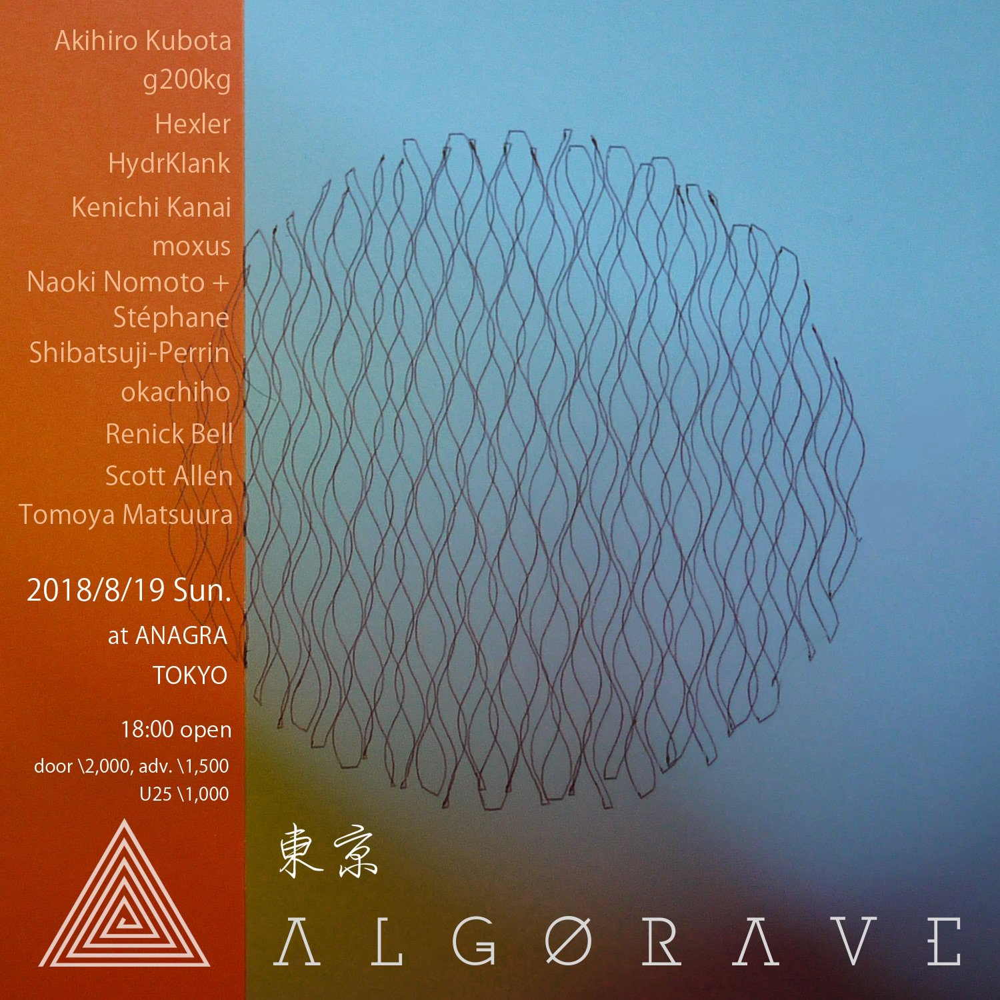

# Algorave Tokyo 2018 Aug 19



## Timetable
https://twitter.com/reprimande/status/1030770377025150976

```
18:00 open
18:30 HydrKlank
19:00 Naoki Nomoto+Stéphane Shibatsuji-Perrin
19:30 Renick Bell+okachiho
20:00 Tomoya Matsuura+moxus(VJ)
20:30 g200kg
21:00 Kenichi Kanai+Hexler
21:30 moxus+Scott Allen
22:00 Akihiro Kubota
```

## Our performance
https://twitter.com/h3xl3r/status/1031194838874509312

https://twitter.com/reprimande/status/1031197194416578561

## Sonic Pi and Petal source code

- [Buffer5.rb](https://github.com/kn1kn1/algorave.tokyo_2018-aug-19/blob/master/Buffer5.rb)
  - Some functions for the performance (loaded in advance)
- [Buffer6.rb](https://github.com/kn1kn1/algorave.tokyo_2018-aug-19/blob/master/Buffer6.rb)
  - the performance
